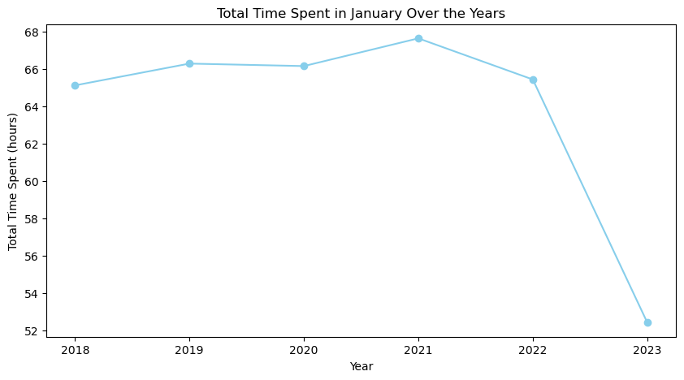
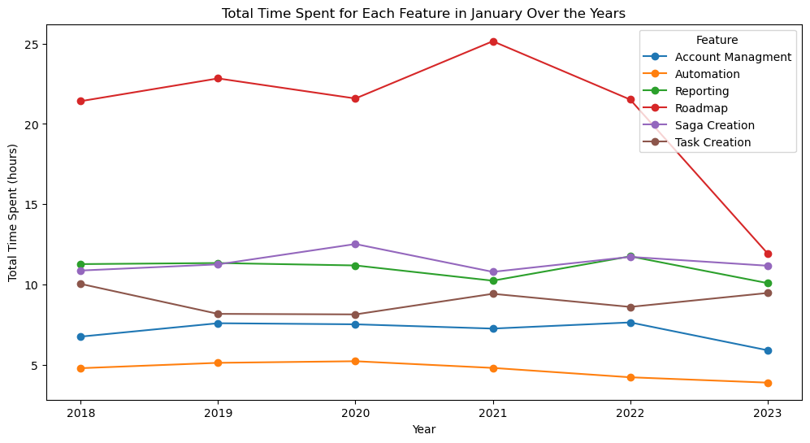
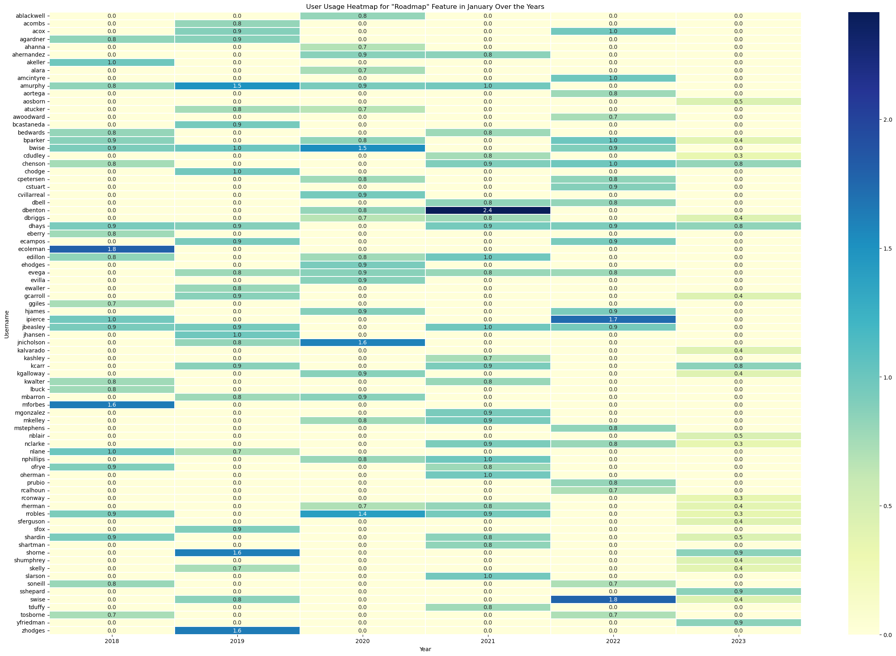

## SaaS User Engagement Analysis - January 2023 Dip

### Objective
This analysis aims to understand user engagement with various features of a SaaS platform over time. This involves examining session data, time spent, and user behaviour to identify trends and insights that can improve product development and user experience.

### Dataset
The dataset used in this analysis includes the following columns:
- `Date`: The date of the user session.
- `Username`: The username of the user.
- `Feature`: The feature used during the session.
- `Sessions`: The number of sessions.
- `Time spent`: The total time spent on the feature in minutes.
- `Average time spent`: The average time spent per session.

The dataset spans from June 2017 to January 2023 and contains 10,575 records.

### Methodology
**Data Loading and Cleaning:** Load the dataset, check for null values, and convert relevant columns to appropriate data types.
**Descriptive Statistics:** Generate summary statistics for the dataset to understand the distribution of sessions, time spent, and average time spent.
**Data Transformation:** Create new columns for month and year from the Date column. 
**Monthly Usage Analysis:** Aggregate data by month and year to analyze trends in total time spent.
**Feature Usage Analysis**: Focus on specific features  to understand user engagement over time.
**User Analysis:** Identify users with significant changes in usage and generate heatmaps for visual representation.
**Session Analysis:** Analyze total sessions and average session time for key features.

### Analysis and Findings

#### Monthly Usage Analysise
A concerning drop in total time spent was observed in January 2023 compared to previous years. This prompted a deeper dive into feature-specific usage.

#### Feature Usage Analysis
Beyond a decrease in account management and reporting, the most concerning finding is the significant 10-hour drop in Roadmap usage

#### User Analysis
The user engagement for roadmap heatmap revealed a decrease in usage by some highly active users in January 2023. This led to further investigation of user behavior.

#### Session Analysis

#### Total Sessions Over the Years
Total Sessions: Confirmed a significant decrease in "Roadmap" sessions in January 2023.

#### Average Time per Session Over the Years
Avg Time per Session: A decrease suggests fewer users are engaging and those who do are spending less time.

To proactively track future performance, monitoring the following metrics is recommended:
- Monthly Active Users (MAU): Number of unique users per month.
- Feature Usage Time: Total time spent on each feature to identify trends and issues.
- Session Duration: Average session duration to understand user engagement.
- Feature-Specific Metrics: Usage metrics tailored to key features like "Roadmap" and "Reporting."
- User Engagement: Track engagement levels of key users or groups to identify potential drops in activity.

### Conclusion
This analysis provides a comprehensive view of user engagement with the SaaS platform's features. By examining session data, time spent, and user behavior, I was able to identify trends and areas for improvement. The proposed metrics will help monitor and optimize the user experience.
